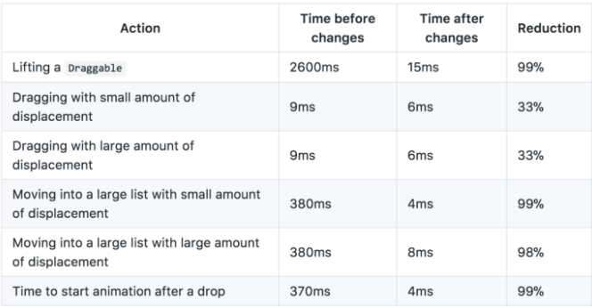
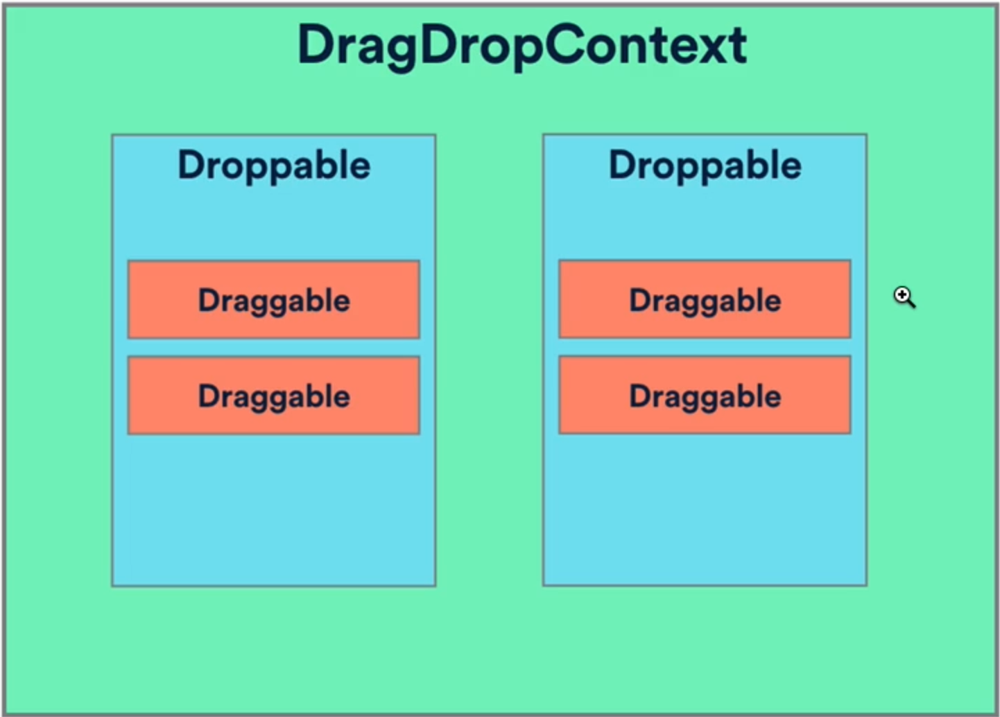
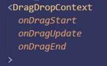

# Drag and drop project using [react-beautiful-dnd](https://github.com/atlassian/react-beautiful-dnd)

This project is mainly for practice and getting to grips with drag and drop interactivity that may be used on the platform.

# Why `react-beautiful-dnd` ?

### Simple API and clear documentation

### Well optimized

Time comparisons between earlier versions and their latest version 4:


### Wide feature set

# Implementation

## React Beautiful Drag and Drop Components



### DragDropContext

A wrapper to enable drag and drop functionality to parts (or all) of the application.

### Droppable

A region of which an draggable components can be dropped into.

### Draggable

Components that can be dragged around and dropped into droppable spaces.

## Callbacks



### onDragStart

Called when a drag has started on an item.

### onDragUpdate

Called when something changes during a drag e.g. positional changes.

### onDragEnd (required)

Called when a drag has ended and applies changes that has resulted from the drag.

There are a couple more callback responders that can be passed into `DragDropContext` alongside with the ones listed above. More in depth explanations for the rest of the responders can be found [here](https://github.com/atlassian/react-beautiful-dnd/blob/master/docs/guides/responders.md).

## Adding drag and drop

### Child functions

Both `<Droppable />` and `<Draggable />` components require a child function that returns a `ReactNode`. Inside of the child functions are where we can render the elements we want to drag and drop, in this case we will iterate through an array of draggable items

```javascript
<Droppable droppableId="droppable-1">
  {(provided, snapshot) => ({
    /*...*/
  })}
</Droppable>
```

```javascript
<Draggable draggableId="draggable-1" index={0}>
  {(provided, snapshot) => (
    <div
      ref={provided.innerRef}
      {...provided.draggableProps}
      {...provided.dragHandleProps}
    >
      Drag me!
    </div>
  )}
</Draggable>
```

## `provided` and `snapshot`

Each child function in `<Droppable />` and `<Draggable />` require the arguments `provided` and `snapshot`, both are objects that contain properties to ensure the drag and drop of elements to work properly.

`provided` Object in `<Droppable />`:

```javascript
type DroppableProvided = {
  innerRef: (?HTMLElement) => void,
  droppableProps: DroppableProps,
  placeholder: ?Node,
};
```

More in-depth explanations of each property can be found [here](https://github.com/atlassian/react-beautiful-dnd/blob/master/docs/api/droppable.md#1-provided-droppableprovided).

`snapshot` Object in `<Droppable />`:

```javascript
type DroppableStateSnapshot = {|
  isDraggingOver: boolean,
  draggingOverWith: ?DraggableId,
  draggingFromThisWith: ?DraggableId,
  isUsingPlaceholder: boolean,
|};
```

More in-depth explanations of each property can be found [here](https://github.com/atlassian/react-beautiful-dnd/blob/master/docs/api/droppable.md#2-snapshot-droppablestatesnapshot).

`provided` Object in `<Draggable />`:

```javascript
type DraggableProvided = {
  innerRef: (HTMLElement) => void,
  draggableProps: DraggableProps,
  dragHandleProps: ?DragHandleProps,
};
```

More in-depth explanations of each property can be found [here](https://github.com/atlassian/react-beautiful-dnd/blob/master/docs/api/draggable.md#1-provided-draggableprovided).

`snapshot` Object in `<Draggable />`:

```javascript
  type DraggableStateSnapshot = {|
    isDragging: boolean,
    isDropAnimating: boolean,
    dropAnimation: ?DropAnimation
    draggingOver: ?DroppableId,
    combineWith: ?DraggableId,
    combineTargetFor: ?DraggableId,
    mode: ?MovementMode,
  |};
```

More in-depth explanations of each property can be found [here](https://github.com/atlassian/react-beautiful-dnd/blob/master/docs/api/draggable.md#2-snapshot-draggablestatesnapshot).

## Updating `onDragEnd`

After implementing what type of content we would like to drag and drop, the next step is to update the `onDragEnd` responder to properly apply the changes we want to make after a drag and drop. Responder are essentially event handlers used to perform state updates in the application, `onDragEnd` is the only required "life cycle" responder but more information about the rest of the responders can be found [here](https://github.com/atlassian/react-beautiful-dnd/blob/master/docs/guides/responders.md#life-cycle-%EF%B8%8F).

### `result`

The `result` object being passed into `onDragEnd` has the following properties:

```javascript
  {
    draggableId: '',
    type: 'TYPE',
    // Where the drag started
    source: {
      droppableId: '',
      index: 0,
    },
    // Where the drag finished
    destination: {
      droppableId: '',
      index: 0,
    },
  }
```

More info on `onDragEnd` behavior can be found [here](https://github.com/atlassian/react-beautiful-dnd/blob/ec06fa266e1617cab2402e0613b36d88b9547f7f/docs/guides/changes-while-dragging.md#dragdropcontext---ondragend-behavior).

## Adding & removing blocks

When adding and removing blocks it is important to not mutate the state object directly as that can cause unexpected side effects e.g. the app crashing and returning a run-time error for `tasks` being `undefined`.

A simple way to tackle this would be to simple make copies of the data you would like to mutate and then apply them to the `state` object.

Example of deleting a task:

```javascript
const deleteTask = (itemId, columnId, index) => {
  setState((oldState) => {
    // Create copy of all current tasks
    const tasksCopy = Object.values(state.tasks);
    // Create copy of taskIds array of the relevant column
    const taskIdsArrayCopy = Array.from(state.droppables[columnId].taskIds);
    // Remove selected task in copy
    tasksCopy.splice(index, 1);
    tasksCopy.filter((task) => task.length);
    // Remove selected task id from taskIds array in copy
    taskIdsArrayCopy.splice(index, 1);
    // Convert array tasks back into object to be passed into state
    const convertedTasks = convertArrayToObject(tasksCopy, "id");
    // Update state with new updated data
    return {
      ...oldState,
      tasks: {
        ...oldState.tasks,
        ...convertedTasks,
      },
      droppables: {
        ...oldState.droppables,
        [columnId]: {
          ...oldState.droppables[columnId],
          taskIds: taskIdsArrayCopy,
        },
      },
    };
  });
};
```

## Cloning/Toolbox feature of the blocks

There is no official support yet from cloning/toolbox like feature for draggables i.e. when you drag a block it should clone a new block for you and not move the original draggabke. But a workaround was proposed in an issues thread [here](https://github.com/atlassian/react-beautiful-dnd/issues/216#issuecomment-423708497).

## Notes

### Multi-block selection
